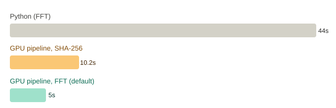

# SignalForge

A GPU-accelerated distributed pipeline for ingesting and deduplicating real-world engine sound recordings. Two independent pipelines are implemented for comparison: a GPU FFT-based pipeline (default) and a GPU SHA-256 pipeline (`--pipeline-sha256`, the industry-standard approach).

A Python multiprocessing baseline implementing the same FFT-based approach was also built for comparison. The C++/CUDA implementation is **8.7x faster** on the same hardware — the reason this project exists as a CUDA pipeline rather than a Python script. See [Benchmark](#benchmark) for details.

SHA-256 is the general-purpose default, and for good reason — it's simple and reliable. But for this domain, understanding the structure of the data reveals a faster, equally valid alternative: GPU-accelerated FFT.



---

## Table of Contents
- [SignalForge](#signalforge)
  - [Table of Contents](#table-of-contents)
  - [Pipeline Architecture](#pipeline-architecture)
  - [I/O Optimization](#io-optimization)
  - [Benchmark](#benchmark)
    - [Future Work](#future-work)
  - [Project Structure](#project-structure)
  - [Requirements](#requirements)
  - [Build \& Run](#build--run)
    - [Windows (Visual Studio)](#windows-visual-studio)
    - [Linux / Docker](#linux--docker)
    - [Run](#run)
  - [Configuration (`config.json`)](#configuration-configjson)
  - [Redis Key Schema](#redis-key-schema)
  - [Tests](#tests)
  - [Credits](#credits)

---

## Pipeline Architecture



**Default pipeline (`--pipeline`, FFT-based deduplication):**

1. **Scanner thread** — reads WAV files from `input_dir` (root and one level of subdirectories)
2. **Reader threads** — read raw PCM data, batch up to `fft.batch_size` files
3. **GPU worker** — runs cuFFT on each batch, pushes magnitude arrays to result queue
4. **Redis writer** — computes xxHash64 of each magnitude array, checks for duplicates, stores new results as `fft_mag:0:<xxhash>` in Redis

**SHA-256 pipeline (`--pipeline-sha256`, industry-standard deduplication):**

1. **Scanner thread** — same as above
2. **Reader threads** — read raw PCM data, batch up to `sha256.batch_size` files
3. **GPU worker** — runs SHA-256 on each batch, pushes hashes to result queue
4. **Redis writer** — checks for duplicates via `sha256:<hex>`, stores new timestamps

**gRPC mode (`--grpc`):**

Scanner is replaced by a gRPC receiver that accepts files from remote clients over the network.

---

## I/O Optimization

File reading uses `mmap` + `posix_fadvise(POSIX_FADV_SEQUENTIAL)` on Linux instead of `std::ifstream`. This eliminates the double-copy that `ifstream` introduces (kernel buffer → ifstream buffer → user buffer) and maps the file directly into the process address space. `posix_fadvise` tells the OS to prefetch pages aggressively starting at the PCM data offset, not from byte 0.

`std::ifstream` is used as a fallback on Windows via `#ifdef _WIN32`.

This is implemented in `WavReader::ReadPCM()` in `SignalForge_CPU/src/WavReader.cpp`.

---

## Benchmark

Tested on AWS EC2 g4dn.xlarge (Tesla T4, 16GB GPU, Ubuntu 22.04), Docker container, CUDA 12.0, 21,528 mixed-size WAV files.

**C++ pipeline comparison:**

| Pipeline | Total | Compute | Waiting | Redis | Throughput |
|----------|-------|---------|---------|-------|------------|
| FFT (default) | 5.1s | 2.5s | 0.6s | 2.2s | ~3,925 files/s |
| SHA-256 | 10.2s | 9.0s | 0.2s | 1.9s | ~1,961 files/s |

FFT-based deduplication gives a **2.0x throughput improvement** over SHA-256 on the same hardware and dataset. SHA-256 compute alone accounts for 88% of its pipeline's total time, while in the FFT pipeline Redis writes are now the largest single component (~43%) — a target for future optimization (see Future Work).

**C++ FFT-only vs Python FFT-only (same hardware):**

| Implementation | Workers | Total | Throughput | vs C++ |
|----------------|---------|-------|------------|--------|
| Python (multiprocessing) | 2 | 47.5s | 421.9 files/s | 9.3x slower |
| Python (multiprocessing) | 4 | 44.3s | 451.5 files/s | 8.7x slower |
| Python (multiprocessing) | 8 | 44.5s | 450.0 files/s | 8.7x slower |
| **C++ CUDA (default)** | — | **5.1s** | **3,925 files/s** | **baseline** |

Config: `fft.batch_size=2048`, `sha256.batch_size=1024`, `fft_size=8192`, `reader_threads=4`.

**Dataset:** 20,020 synthetic engine sound WAV files across four size groups (100KB, 500KB, 1024KB, 2048KB). Each group contains 5 identical "clean" signals (true duplicates) and 1,000-9,000 unique "anomaly" signals with randomized noise, simulating realistic variation between recordings of the same engine. Generated with `SignalForge_Tools/generate_signals.py` using `generate_signals.json`.


### Future Work

**Larger file sizes:** Initial testing with 2-4MB files showed GPU starvation (high "Waiting" time) at the current batch sizes, indicating the reader/batch configuration needs retuning for larger payloads. This is included in the current benchmark dataset (2048KB group) but further tuning may improve results for even larger files.


---


## Project Structure

```
SignalForge/
├── SignalForge/               # Entry point (main.cpp)
├── SignalForge_CPU/           # Pipeline, gRPC receiver, Redis client
├── SignalForge_GPU/           # CUDA kernels: SHA-256, cuFFT
├── SignalForge_Tests/         # GoogleTest unit and integration tests
├── SignalForge_ML/            # PyTorch LSTM autoencoder (anomaly detection)
├── SignalForge_Tools/         # Python signal generator and gRPC client
├── SignalForge_Bench/         # Python baseline benchmarks and NCU/nsys profiling tools
├── scripts/                   # Shell utilities (show-config.sh)
├── SignalForge_Proto/         # Protobuf definitions and generated stubs
├── docs/                      # Diagrams and documentation assets
├── config.json                # Runtime configuration
├── CMakeLists.txt             # Linux/Docker build
├── Dockerfile
├── docker-compose.yml
```

---

## Requirements


| Component       | Details                                           |
|-----------------|---------------------------------------------------|
| GPU             | NVIDIA CUDA-capable (tested on Tesla T4, RTX 3060) |
| CUDA Toolkit    | 12.0+                                             |
| Compiler        | C++20 (MSVC on Windows, GCC on Linux)             |
| Build           | CMake 3.20+                                       |
| Boost           | 1.91+ (Boost.JSON)                                |
| Redis           | 7+ (hiredis client)                               |
| xxHash          | 0.8+ (built from source on Linux, vcpkg on Windows)   |
| gRPC            | 1.54+ with Protobuf                               |
| Python          | 3.10+ with PyTorch (ML module)                    |
| OS              | Windows 10/11, Ubuntu 22.04, Docker               |

---

## Build & Run



### Windows (Visual Studio)

Open `SignalForge.sln` in Visual Studio 2022, select `x64 / Release`, build with `Ctrl+Shift+B`.

### Linux / Docker

```bash
docker compose build
docker compose run signalforge
```

### Run

```bash
# FFT-only pipeline - default, no flag needed
./SignalForge

# SHA-256 + FFT pipeline
./SignalForge --pipeline-sha256

# Hash mode - SHA-256 only, sequential
./SignalForge --hash

# FFT mode - cuFFT only, sequential
./SignalForge --fft

# Profiling mode - SHA-256 with timing
./SignalForge --profile

# gRPC distributed mode
./SignalForge --grpc

# Custom config directory
./SignalForge --config path/to/config

# Windows - same flags, replace ./SignalForge with SignalForge.exe
```

For detailed commands, Docker profiles, Redis setup, and troubleshooting → [dev-guide.md](docs/dev-guide.md)

## Configuration (`config.json`)

```json
{
    "file": {
        "max_file_size_kb": 2048,
        "sample_rate": 44100
    },
    "paths": {
        "input_dir":     "input",
        "output_dir":    "output",
        "test_data_dir": "test_data"
    },
    "kernels": {
        "sha256": { "batch_size": 1024, "threads_per_block": 64 },
        "fft":    { "batch_size": 2048, "threads_per_block": 256, "fft_size": 8192 }
    },
    "pipeline": { "reader_threads": 4 },
    "redis": {
        "host": "redis",
        "port": 6379,
        "db": 0
    },
    "verbose": true
}
```
## Redis Key Schema

| Key | Value | Written by |
|-----|-------|------------|
| `sha256:<hex>` | ISO 8601 timestamp | SHA-256 pipeline writer thread |
| `fft_mag:0:<xxhash>` | Raw float magnitudes | FFT pipeline writer thread |

The `0` in `fft_mag:0:` indicates the entry has not yet been consumed by the LSTM autoencoder. The autoencoder writes `fft_mag:1:` keys after processing.

---
## Tests

123 tests across 10 test suites covering SHA-256, FFT, Redis, pipeline, utils, and gRPC:

```bash
# Linux / Docker
cd /app/x64/Release && ./SignalForge_Tests

# Windows
x64\Release\SignalForge_Tests.exe
```

## Credits
[cuFFT](https://developer.nvidia.com/cufft) by NVIDIA Corporation. Used for GPU-accelerated Fast Fourier Transform batch processing.

The CUDA SHA-256 implementation in `SignalForge_GPU/src/gpu/SignalForge.cu` is based on [cuda-hashing-algos](https://github.com/mochimodev/cuda-hashing-algos) by mochimodev, released into the Public Domain (June 2019).

Original implementation by Brad Conte: [crypto-algorithms](https://github.com/B-Con/crypto-algorithms), Public Domain.

The `cuda_sha256_init`, `cuda_sha256_update`, `cuda_sha256_final`, `cuda_sha256_transform`, and `kernel_sha256_hash` functions were copied directly into `SignalForge.cu` and wrapped with `SHA256HashWrapper_CPU` and `SHA256BatchWrapper_CPU` to fit SignalForge's batch processing pipeline.

[xxHash](https://github.com/Cyan4973/xxHash) by Yann Collet. Used for fast non-cryptographic hashing of FFT magnitude arrays for Redis deduplication keys. Released under the BSD 2-Clause License.